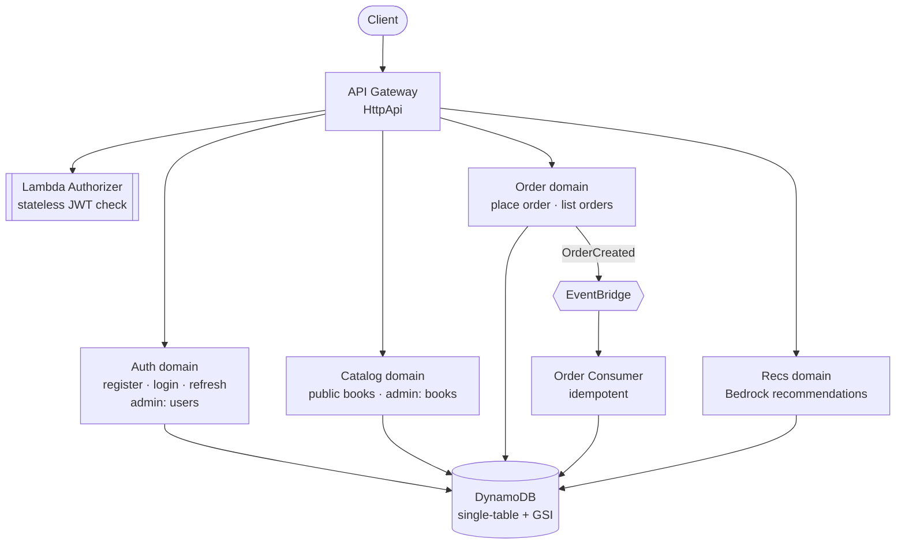

[](https://github.com/spetrykin/serverless-bookstore-aws/actions/workflows/ci.yml)

# serverless-bookstore-aws

> Serverless bookstore backend on AWS — Java 25 / Spring Boot 4.1 / SAM.
> JWT auth with hybrid DynamoDB revocation, single-table design with GSI
> read models, atomic inventory via conditional DynamoDB writes,
> EventBridge event-driven order processing, role-based admin API.

## What this is

A serverless e-commerce backend built less as a CRUD demo and more as a
vehicle for a specific set of hard-to-fake engineering problems: revoking
a token that's designed to be stateless, decrementing shared inventory
correctly under real concurrency, keeping an event-driven pipeline
correct under at-least-once delivery, and scoping IAM per function
instead of by convenience.

The core problems are solved, deployed to a real AWS account,
and re-verified against the live stack — not just written to compile.

This repository is a squashed snapshot of a private development repo;
`docs/incident-log.md` replaces the commit history as the record of what
was found, debugged and decided along the way.

## Architecture



Single HTTP API in front of four domains (Auth, Catalog, Order,
Recommendations). The Recommendations domain is deployed in mock mode
(`RECS_MODE=mock`); no real Bedrock call has been made. Every route
except register/login/refresh goes through one stateless Lambda
Authorizer. Order writes are synchronous against DynamoDB; EventBridge
carries `OrderCreated` to an idempotent consumer for everything
downstream of the order itself.

## Key engineering decisions

- **Hybrid JWT revocation** — stateless access tokens (pure JWT, zero-DB
  authorizer) + DynamoDB-backed refresh tokens, so a blocked user's
  sessions can actually be revoked, not just left to expire.
  → [architecture-plan.md §5.2](docs/architecture-plan.md)
- **Single-table DynamoDB design, GSI read model** — one table, PK/SK
  prefixes per item type, a sparse GSI as the user-facing catalog view.
  Deliberately *not* called CQRS — that word implies a separate
  write/read model this project doesn't have.
  → [architecture-plan.md §1.3](docs/architecture-plan.md)
- **Atomic stock decrement** — raw `UpdateExpression`/`ConditionExpression`
  against the low-level `DynamoDbClient`, not the Enhanced Client's
  bean-based `updateItem`, which can only `SET` an absolute value and
  silently reintroduces a lost-update race under concurrent orders.
  → [architecture-plan.md §6.4](docs/architecture-plan.md)
- **SnapStart + CRaC-managed client lifecycle** — DynamoDB clients are
  closed before an execution-environment freeze and rebuilt fresh on
  restore, so a snapshot never resumes with a dead connection or a stale
  credential timer baked in (first-call latency after restore is a documented open
  item, §5.10).
  → [architecture-plan.md §5.10](docs/architecture-plan.md)
- **Idempotent EventBridge consumer** — EventBridge→Lambda is
  at-least-once delivery by contract; a conditional-write dedup guard
  keyed on `orderId` makes redelivery a no-op instead of a double side
  effect.
  → [architecture-plan.md §1.4](docs/architecture-plan.md)
- **Per-function IAM least-privilege** — every Lambda gets its own
  execution role, audited against what the function's *actual reachable
  code* touches (including bean construction in the shared Spring
  context), not a shared or convenience-scoped role.
  → [architecture-plan.md §1.8](docs/architecture-plan.md)
- **Stateless REQUEST authorizer** — validates signature/expiry/role
  entirely from the JWT itself, no per-request DynamoDB read; the
  tradeoff (an already-issued token outlives a block by up to its own
  TTL) is a named, deliberate one, not an oversight.
  → [architecture-plan.md §5.4](docs/architecture-plan.md)

## Tech stack

Java 25 · Spring Boot 4.1 (Spring Cloud Function AWS adapter) · AWS
Lambda (SnapStart + CRaC) · API Gateway (HttpApi) · DynamoDB · EventBridge
· AWS SAM · GitHub Actions · Argon2id · JJWT · X-Ray (Lambda-level tracing verified
2026-10-06; SDK subsegments deferred)

## Real debugging, not just working code

[`docs/incident-log.md`](docs/incident-log.md) is an append-only record
of real bugs found and fixed against a real deployed stack, not curated
examples: a Spring Cloud Function response-wrapping bug tracked down by
decompiling the adapter's actual bytecode, an `aws-sam-translator` truthy-check
bug traced into its Python source, IAM permission gaps that only surfaced
by watching a live CloudFormation rollback. It's the part of this project
that shows the debugging process, not just its outcome.

The project was built by three participants. The maintainer made the
decisions and ran all deploys and AWS admin actions. Claude, in chat, did
the architecture review and mentoring: decisions were proposed, challenged,
and checked against real AWS behavior rather than taken on documentation
or memory alone. Claude Code did the implementation and verification.
Commits carry a `Co-Authored-By: Claude <noreply@anthropic.com>` trailer.

## Project structure

```
src/main/java/com/serhii/bookstore/
├── auth/      # Register/Login/Refresh/Authorizer + admin user management
├── catalog/   # Public book catalog (GSI read model) + admin book CRUD
├── order/     # Order placement (atomic stock decrement) + OrderCreated publish
├── events/    # EventBridge OrderCreated consumer (idempotent)
├── recs/      # Recommendations: mock engine by default, Bedrock engine behind RECS_MODE=bedrock
└── common/    # DynamoDB client lifecycle (SnapStart/CRaC), JWT/token services, error handling

frontend/      # Vue 3 + Vite demo UI (local only, not deployed)
scripts/       # deploy.sh, wake-stack.sh, seed-test-data.sh, cleanup-orphaned-lambda-artifacts.sh
events/        # sample Lambda event fixtures (placeholders)
.github/workflows/ci.yml  # CI: mvn test, sam validate --lint, sam build; frontend build
docs/          # architecture-plan.md, incident-log.md, requirements.md
template.yaml  # AWS SAM — all infra as code (Lambda, DynamoDB, API Gateway, EventBridge, IAM)
openapi.yaml   # API contract (hand-written)
PROGRESS.md    # snapshot of the current project state
CLAUDE.md      # agent guardrails and documentation rules
```

## Known limitations

- No refresh-token rotation: a refresh token stays valid until its own expiry.
  → [architecture-plan.md §5.14](docs/architecture-plan.md)
- First-call latency after a SnapStart restore is about 5 s; the fix
  (Invoke Priming) is deferred.
  → [architecture-plan.md §5.10](docs/architecture-plan.md)
- SDK-level X-Ray subsegments (DynamoDB/EventBridge calls) are deferred.
  → [architecture-plan.md §5.15](docs/architecture-plan.md)
- No real Bedrock call has been made yet; recommendations run in mock mode.
- The frontend runs locally only; it is not deployed.

## Further reading

- [`docs/architecture-plan.md`](docs/architecture-plan.md) — every
  architectural decision and why, including the ones that got reversed.
- [`docs/incident-log.md`](docs/incident-log.md) — real bugs, real root
  causes, real fixes.
- [`docs/requirements.md`](docs/requirements.md) — the original business
  requirements this backend implements.
- [`openapi.yaml`](openapi.yaml) — the full API contract, hand-written
  against the real DTOs and handlers, not generated. GitHub only shows it
  as plain YAML (no built-in interactive rendering) — paste its contents
  into [editor.swagger.io](https://editor.swagger.io) for an interactive,
  try-it-out view.
- [`CLAUDE.md`](CLAUDE.md) — the guardrails and documentation rules the coding
  agent works under.
- [`PROGRESS.md`](PROGRESS.md) — a snapshot of the current project state.

## Getting started

```bash
mvn test              # 89 unit tests
sam validate --lint
sam build
cd frontend && npm ci && npm run build   # frontend build
```

Deployment is a deliberate manual step, not part of this repo's CI or
tooling — kept that way on purpose.

After a long idle period (more than 14 days) the SnapStart snapshots of a
deployed stack go inactive and the first calls fail with `500`; run
`scripts/wake-stack.sh` to wake all functions (see `docs/incident-log.md`,
2026-10-06) — do not wake them with real requests to the admin or order routes.

### Demo seed data

`scripts/seed-test-data.sh` creates demo users (`loadtest-admin@example.com`,
`loadtest-user1..5@example.com`) that all share the password
`correct-horse-battery-staple`. It is a **demo seed password for a throwaway
dev stack, not a real credential** — never reuse it anywhere else.

### Environment variables used by the scripts

The scripts read environment-specific values from environment variables and
exit with a clear message if a required one is unset. Nothing in the repo
hard-codes an AWS profile or API id.

| Variable | Used by | Meaning |
|---|---|---|
| `ADMIN_PROFILE` | `scripts/deploy.sh`, `scripts/cleanup-orphaned-lambda-artifacts.sh` (or its `--profile` flag), `scripts/seed-test-data.sh` | Name of your full-rights AWS CLI profile (deploy, cleanup, promoting the demo admin) |
| `AGENT_PROFILE` | `scripts/wake-stack.sh` | Name of your restricted (read / invoke) AWS CLI profile |
| `API_URL` | `scripts/seed-test-data.sh` | Base URL of your deployed API Gateway, no trailing slash (the `HttpApiUrl` stack output) |

```bash
export ADMIN_PROFILE=my-admin-profile
export AGENT_PROFILE=my-agent-profile
export API_URL=https://abc123.execute-api.eu-central-1.amazonaws.com
```

`CLAUDE.md` and the docs refer to the same two profiles as `<admin-profile>`
and `<agent-profile>`, and to the API id as `<api-id>`; `openapi.yaml` takes
it as the `apiId` server variable (default `example`).
